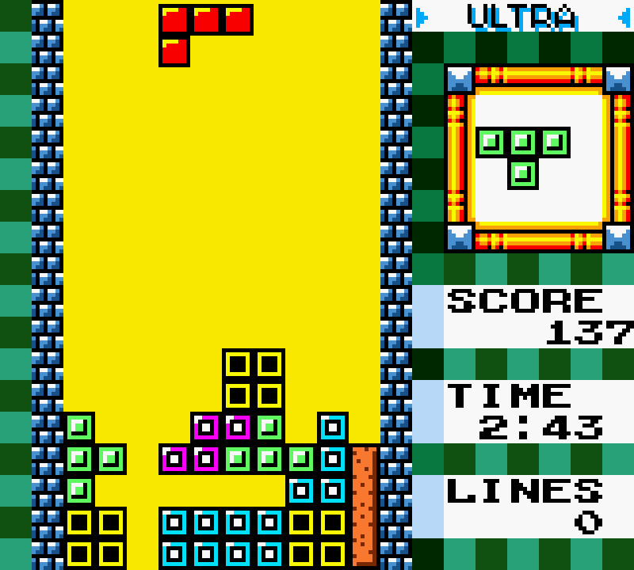

# Tetris Neural Network

## GOALS

- Get a neural network to play tetris.
- Learn about deep Q learning.
- Target score: 10,000 points

## Feature Engineering

The screen taken from the emulator undergoes a lot of pre-processing.
The screen is first turned black and white and then it is sliced so it only includes
the tetris board without any of the score, line count, level, or next piece information
The end result is an array that represents the max height of each column of blocks.

todo: describe feature engineering more.

## Optimization Methodology

todo: describe optimization

## Gameplay

todo: show gameplay with gif

## Thanks

* Alexey Pajitnov, for designing such a wonderful game.
* [Playing Tetris with Deep Reinforcement Learning](http://cs231n.stanford.edu/reports/2016/pdfs/121_Report.pdf)
